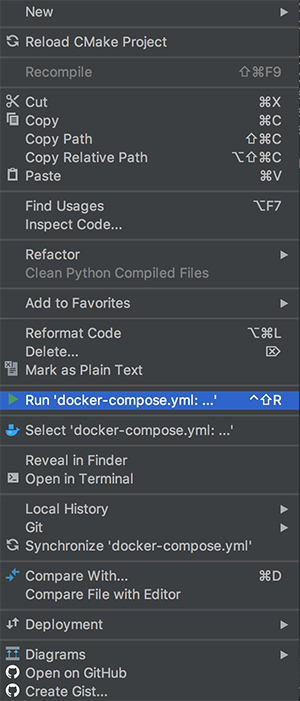
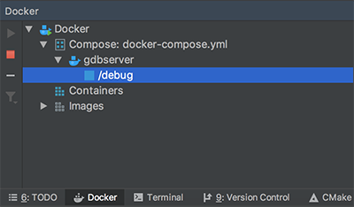
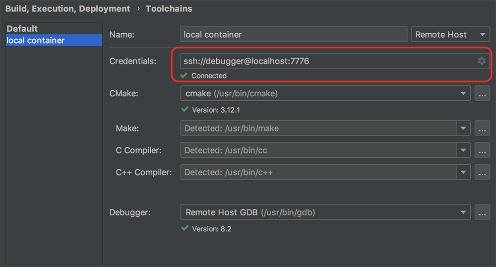
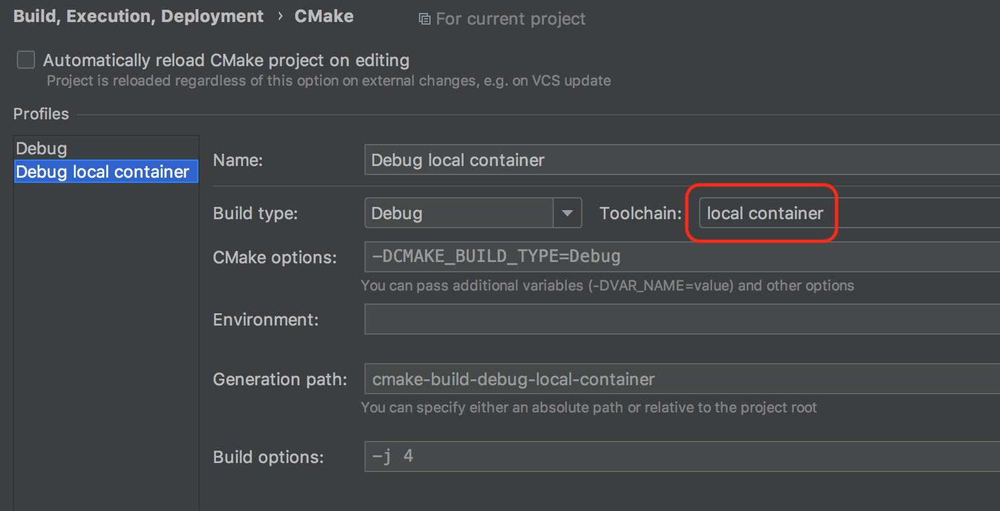
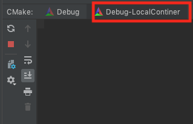
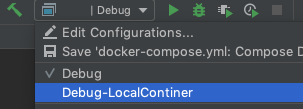

# Debugging C++ in a Docker Container with CLion

> Note: Source code is modified from [Cornell CS 5450 course material](
https://pages.github.coecis.cornell.edu/cs5450/website/assignments/p1/docker.html).

> **Update December 2018:** this repository has been updated after the Clion 2018.3 release, which adds native remote debugging support.
Check out the [official guide](https://blog.jetbrains.com/clion/2018/09/initial-remote-dev-support-clion/) It makes a debugger's life much easier. HOORAY!

This repository provides a minimal C++ project setup and the Dockerfile that
allows developers to debug code in a Docker container using JetBrain Clion IDE.

Debugging in a container has many benefits, especially if you are developing
Linux applications on OS X.

+ It allows a consistent environment for both development and deployment;
+ Developers are free from installing dependencies on their development
machine. Some packages cannot be easily installed on OS X.
+ The container can be launched on your development machine, or on a remote server.

## Introduction

All application code, as well as its **dependencies**, will be installed, compiled, and ran within the container.

Clion supports remote debugging feature since [2018.3](https://blog.jetbrains.com/clion/2018/09/initial-remote-dev-support-clion/).

The container has a long running ssh server process, such that the container can
be placed on a remote host. 本质上即在Docker容器内运行ssh server，ssh server默认端口22，进行容器端口映射为7776后，即可从本地进行远程ssh连接（类似远程调试服务器那样）。
例如：ssh debugger@localhost -p 7776

> The container exposes 2 ports. 7777 is for `gdbserver` connection. 22 for the
ssh server. To avoid trouble when the container is launched on the development
machine, the container 22 port is mapped to host 7776 port. This can be changed
to any arbitrary number in `docker-compose.yml`.

## Prerequisites

On your development machine, you must have a CLion IDE (2018.3 or above) installed,

On the host machine of your container (which can be the development machine),
the latest Docker CE installation would be sufficient.

## Usage

To debug the example, follow the following steps. If you have any problem, please refer to the [official tutorial](https://blog.jetbrains.com/clion/2018/09/initial-remote-dev-support-clion/) before opening an issue. 下面1-3步目的是创建带ssh server功能的Docker容器，可以不用完全按照这个步骤来，只要创建成功即可。创建成功后，可在命令行通过ssh命令测试是否能成功连接。4-6步是重点配置过程。

### Step1 - Dockerfile

Modify [this Dockerfile](https://github.com/gjgjh/docker-clion-dev/blob/master/Dockerfile) to install any dependencies your project needs. Add the Dockerfile to your project. The default dockerfile provides essential building tools when developing c++.

### Step2 - Docker Compose

In the same directory as the previous docker file, create a [docker-compose.yaml](https://github.com/gjgjh/docker-clion-dev/blob/master/docker-compose.yml) file. You can also use the default docker-compose file.

### Step3

Ensure that the `Dockerfile` and `docker-compose.yml` files are in the same directory.

#### Option 3A (With CLion Docker Plugin)

Right-click the `docker-compose.yml` file and select `Run`.



After a minute or two the container should be created and be viewable from Clion's Docker tab.



#### Option 3B (Without CLion Docker Plugin)

From the directory containing the `Dockerfile` and `docker-compose.yml` files, run:

```bash
docker-compose up -d
```
After this step, the container is running with an ssh server daemon. Clion will automatically run/test/debug via an ssh connection. The folder where `docker-compose.yml` locates will be the mapped to `/home/debugger/code` within the container. CLion will *not* use this mapped directory.

### Step 4 - Configure Toolchain

Open **Settings->Build, Execution, Deplyment -> Toolchains** and create a new **Remote Host**Toolchain.

In the **Credentials** field click the small folder on the right side and enter the credentials for the debugger user created in the Dockerfile.

In the example above the username is "debugger" and the password is "pwd".



### Step 5 - CMake Profile

Now we must set up a CMake profile to make use of our new Remote Host toolchain.

Navigate to **Settings->Build, Execution, Deplyment -> Cmake** and create a new profile. The only necessary change is selecting the toolchain created in the previous step.



### Step 6 - Running/Debugging the Program

From the CMake tab, make sure that you have the newly created CMake profile selected.



After the CMake project loads into the container, you should be able to select the CMakeProfile you would like to use in the run configuration switcher in the top right corner of CLion.



Hopefully if everything went well you should now be able to run and ebug code in a docker container!

## Reference

Some references may also be helpful:

- [How to code/run programs in a Docker container using CLion?](https://stackoverflow.com/a/55424792/10974014)

- [docker-clion-dev Guide](https://github.com/shuhaoliu/docker-clion-dev)
- [CLion Remote Project Guide](https://blog.jetbrains.com/clion/2018/09/initial-remote-dev-support-clion/)
- [Clion CMake Profiles](https://www.jetbrains.com/help/clion/cmake-profile.html)
- [CLion CMake Toolchains](https://www.jetbrains.com/help/clion/how-to-create-toolchain-in-clion.html)

## Customization

+ Add dependency installation scripts to `Dockerfile`.
+ Replace `CMakeLists.txt` with your customized project `CMakeLists.txt`.
